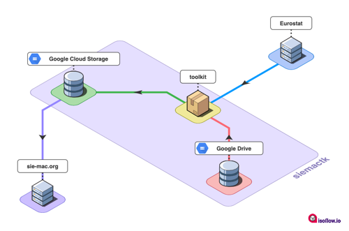

**Toolkit to support operations on [sie-mac.org](https://sie-mac.org)**

# Workflow



1. Get datasets urls and codelists from Google Spreadsheets.
2. Scrap these datasets from https://ec.europa.eu/eurostat.
3. Filter, clean & recode datasets.
4. Generate translated output files in both `.json` and `.tsv` formats.
5. Upload output files to a bucket in Google Cloud Storage (GCS).
6. Notify via email the result of the automation process.

Thus, site sie-mac.org can report tables with [wpDataTables](https://wpdatatables.com/) plugin, sourcing from data on GCS.

# Auth

This project uses [Google Drive API](https://developers.google.com/drive) and [Google Cloud Storage](hhttps://cloud.google.com/storage) behind the scenes. Both services need [authentication](https://cloud.google.com/docs/authentication).

## Google Drive API

As siemactk uses [yagdrive](https://github.com/sdelquin/yagdrive) as a wrapper for the Google Drive API, you should follow [these instructions](https://github.com/sdelquin/yagdrive#auth) in order to make it properly work.

At the end of the authentication process, two files must be saved in the present work directory:

- `gdrive-credentials.json`
- `gdrive-secrets.json`

## Google Cloud Storage

Follow these instructions in order to get authentication for the Google Cloud Storage:

1. Go to [APIs Console](https://console.cloud.google.com/) and create a new project (or reuse an existing one).
2. Go to [IAM Administration](https://console.cloud.google.com/iam-admin/) inside your project and click on [Service Accounts](https://console.cloud.google.com/iam-admin/serviceaccounts) on the left hand side.
3. Click on [Create Service Account](https://console.cloud.google.com/iam-admin/serviceaccounts/create) on the header of the page.
4. Three steps must be completed:
   - Step 1: Give a name for this service account.
   - Step 2: Assign function "Owner" to completely access the project.
   - Step 3: You can leave it blank.
5. Click on the newly created service account.
6. Go to the "Keys" menu at the top.
7. Click on the "Add Key" button and then select "Create new key".
8. Leave "JSON" as the type of key and click on "Create".
9. A file called `<project>-<long_id>.json` is downloaded.
10. Rename this file to `gcs-credentials.json` and place it on the present work directory.

At the end of the authentication process, one file must be saved in the present work directory:

- `gcs-credentials.json`

# Setup

1. Install dependencies:

   ```console
   $ pip install -r requirements.txt
   ```

2. Generate [credentials for authentication](#Auth).
3. Create a `.env` file containing parameters with no default values on [settings.py](settings.py).

# Usage

```console
$ python main.py
```

## GitHub Workflow

In order to automate the launching of this scraping, a GitHub workflow has been developed and scheduled every month.

# Changelog

Consult the [Changelog](CHANGELOG.md) page for bugfixes and features in each version.
